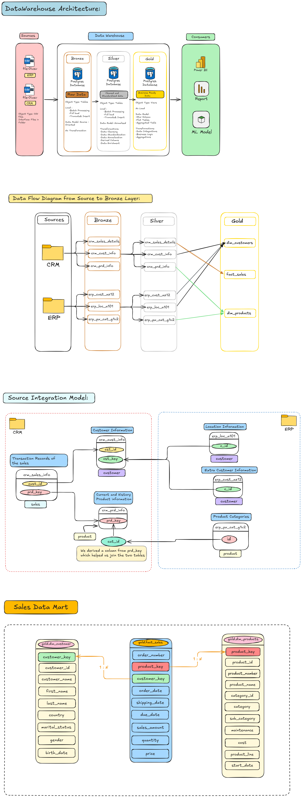

# 🚀 PostgreSQL Data Warehouse Project

A modern **Data Warehouse** implementation built using **PostgreSQL**, following the **Medallion Architecture (Bronze → Silver → Gold)**. This project demonstrates an end-to-end ETL pipeline, data quality transformations, dimensional modeling, and analytical data presentation using a **Star Schema**.

---

## 📌 Project Overview

Organizations often store business data across multiple operational systems such as **CRM** and **ERP** platforms. While these systems are optimized for transactional processing, they are not designed for analytical reporting.

This project consolidates raw operational data into a centralized PostgreSQL Data Warehouse, where the data is progressively transformed into clean, business-ready datasets suitable for analytics and reporting.

The warehouse follows the Medallion Architecture:

* 🥉 **Bronze Layer** – Raw data ingestion
* 🥈 **Silver Layer** – Data cleansing and transformation
* 🥇 **Gold Layer** – Business-ready dimensional models

---

# 🏗️ Architecture



> **Figure 1:** End-to-end Data Warehouse architecture illustrating the Medallion Architecture, ETL workflow, source system integration, and Star Schema.

---

# ✨ Features

* Medallion Architecture (Bronze, Silver, Gold)
* Modular ETL Pipeline
* PostgreSQL Stored Procedures
* Data Validation & Cleansing
* Star Schema Design
* Dimension & Fact Modeling
* Data Quality Checks
* Comprehensive Project Documentation
* Enterprise-style Folder Structure

---

# 🛠️ Technology Stack

| Technology | Purpose                          |
| ---------- | -------------------------------- |
| PostgreSQL | Relational Database              |
| PL/pgSQL   | Stored Procedures                |
| SQL        | Data Definition & Transformation |
| pgAdmin    | Database Administration          |
| Git        | Version Control                  |
| GitHub     | Repository Hosting               |

---

# 📂 Project Structure

```text
DataWarehouse/
│
├── datasets/
│
├── docs/
│   ├── architecture.md
│   ├── project_overview.md
│   ├── etl_workflow.md
│   ├── naming_conventions.md
│   ├── data_catalog.md
│   └── images/
│       └── data_warehouse_architecture.png
│
├── sql/
│   ├── bronze/
│   ├── silver/
│   ├── gold/
│   └── logging/
│
├── procedures/
│
├── README.md
└── LICENSE
```

---

# 📊 Data Warehouse Architecture

The warehouse follows a layered architecture where each layer has a specific responsibility.

| Layer  | Purpose                                                 |
| ------ | ------------------------------------------------------- |
| Bronze | Stores raw data exactly as received from source systems |
| Silver | Cleanses, validates, and standardizes data              |
| Gold   | Provides business-ready analytical models               |

---

# ⭐ Star Schema

The Gold layer is modeled using a Star Schema consisting of:

### Dimension Views

* `dim_customers`
* `dim_products`

### Fact View

* `fact_sales`

The fact table references surrogate keys from the dimensions to simplify analytical queries and improve reporting performance.

---

# 🔄 ETL Workflow

```text
CSV Files
      │
      ▼
Bronze Layer
      │
      ▼
Silver Layer
      │
      ▼
Gold Layer
      │
      ▼
Business Analytics
```

The ETL process performs:

* Raw data ingestion
* Data validation
* Data cleansing
* Standardization
* Data enrichment
* Surrogate key generation
* Dimension lookup
* Star Schema creation

---

# 📖 Documentation

Detailed project documentation is available in the **docs** folder.

| Document                                         | Description                         |
| ------------------------------------------------ | ----------------------------------- |
| [Project Overview](docs/project_overview.md)     | Executive summary and project goals |
| [Architecture](docs/architecture.md)             | Data Warehouse architecture         |
| [ETL Workflow](docs/etl_workflow.md)             | Complete ETL process                |
| [Naming Conventions](docs/naming_conventions.md) | Naming standards                    |
| [Data Catalog](docs/data_catalog.md)             | Gold layer metadata                 |

---

# 🚀 Getting Started

## 1. Clone the Repository

```bash
git clone https://github.com/<your-username>/DataWarehouse.git
```

---

## 2. Create Database

Create a PostgreSQL database using pgAdmin or psql.

---

## 3. Execute SQL Scripts

Run the scripts in the following order:

```text
sql/bronze/ddl_bronze.sql

↓

Import CSV Files

↓

sql/silver/ddl_silver.sql

↓

CALL bronze.load_bronze();

↓

CALL silver.load_silver();

↓

CALL gold.load_gold();
```

---

## 4. Verify Gold Views

```sql
SELECT * FROM gold.dim_customers;

SELECT * FROM gold.dim_products;

SELECT * FROM gold.fact_sales;
```

---

# 📈 Future Improvements

* ETL Logging
* Incremental Loading
* Apache Airflow Orchestration
* PostgreSQL COPY Automation
* Power BI Dashboard
* Cloud Deployment
* Apache Kafka Integration
* Apache Spark Processing

---

# 📚 Key Concepts Demonstrated

* Data Warehousing
* Medallion Architecture
* ETL Pipelines
* PostgreSQL
* PL/pgSQL
* Star Schema
* Data Modeling
* Data Quality
* Dimensional Modeling
* Data Engineering Best Practices

---

# 🤝 Contributing

Contributions, suggestions, and improvements are welcome.

Feel free to fork the repository and submit a pull request.

---

# 📄 License

This project is licensed under the MIT License.

---

## 👨‍💻 Author

**Manthan Badwanache**

Just a person learning how to solve problems .

---

⭐ If you found this project useful, consider giving it a star on GitHub.
